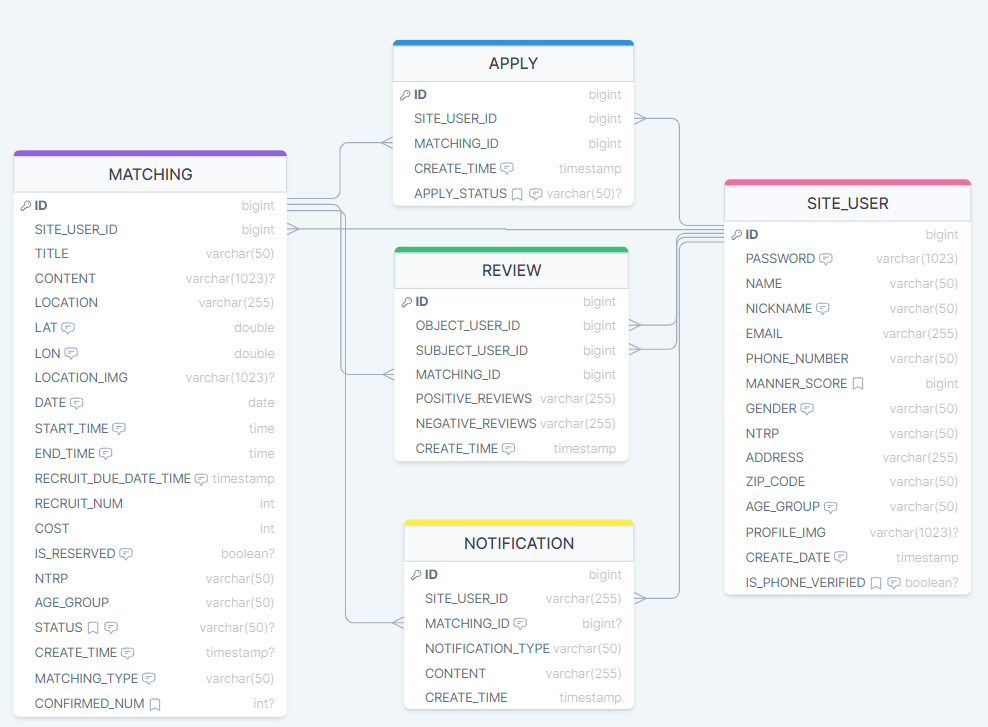

# Racket Puncher BackEnd GitHub

20-30대를 중심으로 빠르게 성장하는 테니스 인기를 반영하여 기존 매칭 플랫폼들과 차별화된 기능을 제공하는 새로운 테니스 경기 매칭 플랫폼, 라켓펀처의 백엔드 깃허브입니다!🥎

## 프로젝트 기능 및 설계

- **회원가입 기능**
    - 회원가입은 일반 회원가입, 소셜 미디어 회원가입을 할 수 있다.
    - 회원가입을 하려면 이메일, 비밀번호, 이름, 닉네임, 전화번호, NTRP, 활동지역, 연령대, 성별을 필수로 입력해야 한다.
    - 회원가입 필수 사항 외 선택 사항으로는 프로필 사진이 있다.
    - 프로필 사진의 최대 크기가 3MB 이상인 경우 AWS Lambda를 사용하여 자동으로 파일 크기를 축소한다.
    - 회원 가입시에는 휴대폰 인증이 필요하다.
    - 소셜 미디어를 통한 회원가입 시 필수 정보를 요청한다.
    - 닉네임은 숫자와 문자로만 작성해야 한다.
    - 비밀번호는 8자 이상, 숫자/소문자/대문자/특수문자를 각 최소 하나씩 포함 해야 한다.
    - 본인 인증을 마친 회원만 매칭 등록 및 참여 서비스를 이용할 수 있다.

- **로그인 기능**
    - 매칭 서비스를 사용하려면 계정을 가지고 있어야 한다.
    - 로그인을 한 이용자만 매칭 서비스 이용이 가능하다.
    - Access Token의 유효시간은 1시간, Refresh Token의 유효시간은 14시간 으로로 한다. 로그아웃 시 만료된다.

- **로그아웃 기능**
    - 로그인된 세션을 종료하고 로그아웃 상태로 돌아갈 수 있다.

- **ID(이메일 주소) 찾기 / PW 재설정**
    - 아이디 찾기/비밀번호 찾기는 핸드폰 인증을 통해 이용 가능하다.
    - 핸드폰 인증을 통해 아이디는 바로 확인 가능하며 비밀번호는 초기화 된다.
    
- **내 정보 조회/수정 기능**
    - 사용자는 자신의 계정에 로그인해야 개인 정보를 조회/수정할 수 있다.
    - 사용자는 비밀번호 확인을 통해 개인 정보 수정을 할 수 있다.

- **이용자 간 리뷰, 매너 점수 입력/조회 가능**
    - 상대방에 대한 리뷰를 남길 수 있다.
        - “정중한 말투로 경기에 임했어요.”, “성실한 태도로 경기에 임했어요.” 이런 식으로 멘트를 선택할 수 있다.
        - 기본 점수는 0점부터 시작한다.
        - 점수의 최솟값, 최댓값은 없다.
        - 리뷰 선택 갯수에 따라 점수에 반영된다.
        - 받은 리뷰 점수는 매너 점수에 누적된다.
    - 매너점수가 100점마다 테니스공이 하나씩 추가된다.
    
    - **추가 점수**
        - **긍정적 리뷰 선택 개수에 따라 매너 점수 증가**
            - 친절해요.(+2)
            - 약속 시간을 잘 지켜요.(+2)
            - 매너가 좋아요.(+2)
            - 경기 진행 과정에서 도움을 줬어요.(+2)
            - 경기에 적극적으로 임해요.(+2)
            
        - **부정적 리뷰 선택 개수에 따라 매너 점수 감소**
            - 노쇼했어요.(-10)
                - 해당 리뷰가 선택된 경우, 다른 리뷰의 선택 여부 상관 없이 -10점을 바로 매너 점수에 반영한다.
            - 허위 매칭글이에요(-15)
                - 단식 경기의 경우 평균점수 없이 -15점을 바로 매너 점수에 반영한다.
                - 경기 참여자가 2명 이상인 경우, 2명 이상이 허위 매칭글임을 선택하면 -15점을 바로 매너 점수에 반영한다.
            - 채팅방에서 욕설을 했어요.(-3)
            - 경기 중에 욕설을 했어요.(-3)
            - 약속 시간에 늦었어요.(-2)
            - 행동이 과격해요.(-3)
            - 다른 참가자를 불편하게 해요.(-2)
            - 배려심이 부족해요.(-2)
        - **이외의 패널티 점수**
            - 신청자가 있는 매칭글 삭제 (-5점), 신청자가 있는 매칭글 수정 (-3점), 매칭 확정 후 매칭 취소 (-5점)

- **나의 매칭 리스트 조회 기능**
    - 이용자는 자신이 등록한 매칭을 조회할 수 있다.
    - 이용자는 자신이 신청한 매칭을 조회하여 확정 여부를 확인할 수 있다.
    
- **이용자간 프로필 조회 기능**
    - 이용자는 다른 이용자의 프로필 정보를 조회할 수 있다.
    - 다른 이용자의 정보는 사진, 닉네임, 활동지역, NTRP, 성별, 매너점수, 연령대를 조회할 수 있다.

- **지도 기반 내 주변 매칭 조회 기능**
    - 이용자는 선택한 지역를 기준으로 반경 3km 내의 매칭 정보 조회가 가능하다.
    - 지도에 표시된 경기를 선택하게 되면 리스트에 해당 매칭만 표시된다.
    
- **매칭 리스트 필터링/정렬 기능**
    - 이용자는 매칭 리스트를 필터링 할 수 있다.
        - 이용자는 원하는 날짜/지역/경기 유형/모집 연령대/모집 수준을 선택하여 주변 매칭 정보를 조회할 수 있다.
    - 이용자는 매칭 리스트를 정렬 할 수 있다.
        - 이용자는 마감 임박순 매칭을 조회할 수 있다. ⇒ previewDto에 마감 시간/등록 시간을 보여준다.
        - 이용자는 최근 등록순 매칭을 조회할 수 있다.

- **매칭 글 등록/수정/삭제 기능**
    - 이용자는 매칭 글을 등록/수정/삭제할 수 있다.
    - 매칭 글을 등록한 사람이 매칭 주최자로 명시된다.
    - 매칭 주최자는 경기장 예약 여부를 등록 해야 한다.
    - 한 명의 이용자가 여러 개의 매칭 글을 등록할 수 있다.
    - 신청자 혹은 확정자가 있는 경우 매칭 글을 삭제할 경우 패널티가 적용된다.
        - 예외 : 우천시 패널티 없이 삭제 가능
    - 매칭 당일, 매칭 글을 삭제가 불가능하다.
        - 예외 : 우천시 삭제 가능
    - 매칭글이 수정/삭제되는 경우 매칭에 포함된 신청자, 확정자에게 알림이 간다.

- **매칭 참여 신청/취소 기능**
    - 이용자는 매칭 신청을 할 수 있다.
    - 매칭 신청자는 매칭 일자 하루 전까지 매칭 신청을 취소할 수 있다.
    - 매칭 확정자는 매칭 취소시 패널티가 부여된다.
        - 예외 : 우천시 삭제 가능
    - 다른 유저가 매칭 글에 참여 신청/취소를 한경우 매칭 주최자에게 알림을 보낸다.

- **주최자의 매칭 참가 수락 기능**
    - 매칭 주최자는 매칭 신청자를 매칭 참여자로 정할 수 있다.
    - 매칭 참여자는 실시간으로 반영되어 다른 이용자들이 확인할 수 있다.
    - 매칭 참가 수락시 해당 유저에게 매칭 참가 신청이 수락되었다는 알림을 보낸다.

- **채팅 기능**
    - 매칭이 확정된 경우 이용자 간의 그룹 채팅이 가능하다.
    - 매칭 다음 날 그룹 채팅은 자동으로 삭제된다.
    - 특정 메세지를 선택하여 욕설 신고를 할 수 있다.
    - 새로운 채팅이 왔을 때, 알림을 보낸다.

- **알림 기능**
    - 매칭글이 수정/삭제되는 경우 매칭에 포함된 신청자, 확정자에게 알림을 보낸다.
    - 다른 유저가 매칭 글에 참여 신청/취소를 한경우 매칭 주최자에게 알림을 보낸다.
    - 매칭 확정/실패 시 해당 유저에게 매칭 확정 알림을 보낸다.
    - 새로운 채팅이 왔을 때, 알림을 보낸다.
    - 매칭 날 기상예보에 비 혹은 눈이 예정되어 있는 경우 날씨 알림을 보냅니다.
    - **알림 종류**
        - [등록자] 새로운 신청
        - [등록자 & 신청자] 경기 확정/실패
        - [등록자 & 신청자] 경기 수정/삭제
        - [등록자 & 신청자] 리뷰 작성
        - [신고자] 신고 완료
        - [등록자 & 신청자] 날씨 알림

## ERD

### Tech Stack
- Language: Java 17
- Framework: Spring Boot (3.1.5)
- Build Tool: Gradle
- Deploy Tool: AWS EC2
- Auth: Spring security, JWT, OAuth 2.0 (Kakao)
- DB: MySQL
- Image Storage: S3
- Temporary data storage/caching : Redis
- Test : Postman, Junit, Mockito
- Weather Open API: Korea Meteorological Administration Short-Term Forecast Retrieval API
- Address Open API: Ministry of the Interior and Safety Address API
- HTTP Client Tool: OpenFeign
- Json Parsing: Custom serializer extends by JsonSerializer
- CI/CD tools: Docker, Jenkins
